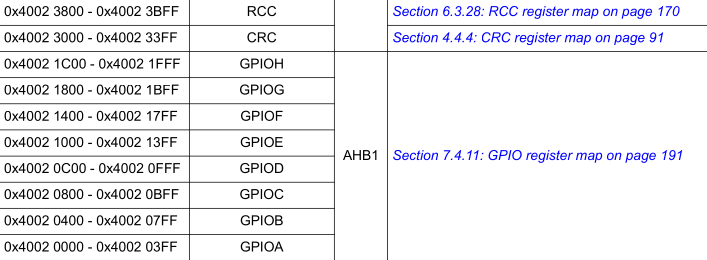

# STM32F446 Custom HAL Blinky

After experimenting with GPIO and its registers, the logical step up to this project is to create our own custom HAL for handling the memory addresses. As a first step, we can basically delete the contents of the Inc/ folder, as we will be creating our own header file. Next, we can begin writing our header file. In a new `my_stm32f446xx.h` file, we begin to write some code.

Having implemented the blinky with the HAL provided by ST Microelectronics, we know a couple of our needs:

* RCC struct
* GPIOx struct (one for each GPIO port A-H)
* Base addresses for each struct
* Pin handling functions (GPIO_write_pin for example)

So, I begin writing a general code structure:

```c
#define __I volatile const /**< Defines read permission */
#define __IO volatile      /**< Defines read / write permissions */
#define __O volatile       /**< Defines write permission */

typedef struct {

} RCC_typedef;

#define RCC_BASE 0x00000000

#define RCC (RCC_typedef *)RCC_BASE

typedef struct {

} GPIO_typedef;

#define GPIOA_BASE 0x00000000
#define GPIOB_BASE 0x00000000
#define GPIOC_BASE 0x00000000
#define GPIOD_BASE 0x00000000
#define GPIOE_BASE 0x00000000
#define GPIOF_BASE 0x00000000
#define GPIOG_BASE 0x00000000
#define GPIOH_BASE 0x00000000

#define GPIOA (GPIO_typedef *)GPIOA_BASE
#define GPIOB (GPIO_typedef *)GPIOB_BASE
#define GPIOC (GPIO_typedef *)GPIOC_BASE
#define GPIOD (GPIO_typedef *)GPIOD_BASE
#define GPIOE (GPIO_typedef *)GPIOE_BASE
#define GPIOF (GPIO_typedef *)GPIOF_BASE
#define GPIOG (GPIO_typedef *)GPIOG_BASE
#define GPIOH (GPIO_typedef *)GPIOH_BASE
```

Next, we need to fill the struct with all the registers indicated by the Reference Manual (RM0390). For example, this would be the RCC struct.

```c
typedef struct {
  __IO uint32_t CR;
  __IO uint32_t PLLCFGR;
  __IO uint32_t CFGR;
  __IO uint32_t CIR;
  __IO uint32_t AHB1RSTR;
  __IO uint32_t AHB2RSTR;
  __IO uint32_t AHB3RSTR;
  uint32_t RESERVED0;
  __IO uint32_t APB1RSTR;
  __IO uint32_t APB2RSTR;
  uint32_t RESERVED1[2];
  __IO uint32_t AHB1ENR;
  __IO uint32_t AHB2ENR;
  __IO uint32_t AHB3ENR;
  uint32_t RESERVED2;
  __IO uint32_t APB1ENR;
  __IO uint32_t APB2ENR;
  uint32_t RESERVED3[2];
  __IO uint32_t AHB1LPENR;
  __IO uint32_t AHB2LPENR;
  __IO uint32_t AHB3LPENR;
  uint32_t RESERVED4;
  __IO uint32_t APB1LPENR;
  __IO uint32_t APB2LPENR;
  uint32_t RESERVED5[2];
  __IO uint32_t BDCR;
  __IO uint32_t CSR;
  uint32_t RESERVED6[2];
  __IO uint32_t SSCGR;
  __IO uint32_t RRC_PLLI2SCFGR;
  __IO uint32_t RRC_PLLSAICFGR;
  __IO uint32_t DCKCFGR;
  __IO uint32_t CKGATENR;
  __IO uint32_t DCKCFGR2;
} RCC_typedef;
```

Once filled the structs, we need to map their macros to the corresponding memory addresses. We can get the memory addresses from Section 2.2.2 Table 1. STM32F446xx register boundary addresses:



```c
#define PERIPH_BASE 0x40000000UL

#define APB1PERIPH_BASE PERIPH_BASE
#define APB2PERIPH_BASE (PERIPH_BASE + 0x00010000UL)
#define AHB1PERIPH_BASE (PERIPH_BASE + 0x00020000UL)
#define AHB2PERIPH_BASE (PERIPH_BASE + 0x10000000UL)
#define AHB3PERIPH_BASE (PERIPH_BASE + 0x20000000UL)

#define RCC_BASE (AHB1PERIPH_BASE + 0x00003800UL)

#define GPIOA_BASE (AHB1PERIPH_BASE)
#define GPIOB_BASE (AHB1PERIPH_BASE + 0x00000400UL)
#define GPIOC_BASE (AHB1PERIPH_BASE + 0x00000800UL)
#define GPIOD_BASE (AHB1PERIPH_BASE + 0x00000C00UL)
#define GPIOE_BASE (AHB1PERIPH_BASE + 0x00001000UL)
#define GPIOF_BASE (AHB1PERIPH_BASE + 0x00001400UL)
#define GPIOG_BASE (AHB1PERIPH_BASE + 0x00001800UL)
#define GPIOH_BASE (AHB1PERIPH_BASE + 0x00001C00UL)
```

Next, we have to create macros for the bits for each corresponding register. We will follow the same pattern as the manufacturer, where we create a position macro, representing which bit in the register we are addressing, a mask macro, where we shift the value to its desired position in the register to clear bits without varying the others, and the base macro, to toggle a specific bit. For example:

```c
#define RCC_CR_HSEON_Pos        (16U)
#define RCC_CR_HSEON_Msk        (0x1UL << RCC_CR_HSEON_Pos)
#define RCC_CR_HSEON            RCC_CR_HSEON_Msk

//For bigger bit fields we do as follows

#define RCC_CR_HSITRIM_Pos      (3U)
#define RCC_CR_HSITRIM_Msk      (0x1FUL << RCC_CR_HSITRIM_Pos)
#define RCC_CR_HSITRIM          RCC_CR_HSITRIM_Msk
```
