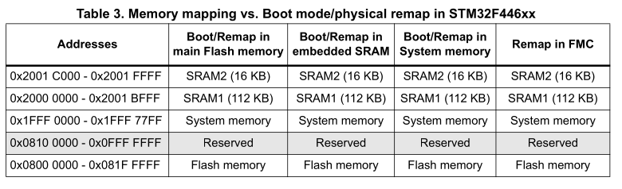

# STM32F446 Blinky
---

A bare-metal blinky implementation for the STM32 Nucleo-F446RE dev kit, as a beginner project to dive into embedded systems.


# Memory and registers
---

First, we need to consult the Reference Manual for the MCU (RM0390). As seen in section 2.3, Table 3, the MCU has 128kB for RAM and 512kB for flash memory (ROM).
As seen in the table, the RAM section begins at 0x20000000 and flash at 0x08000000.



To know the registers we have to modify, we need to consult the Reference Manual section for GPIO ports (7.4). For example, GPIO port A (GPIOA) region begins at 0xA8000000, and from Table 1 in section 2.2.2 we know it has length of 1kB.

This is important because from the User Manual (UM1724 section 7.6) we learn that the User LD2 corresponds to I/O PA5 (pin 21), meaning it is located in GPIO port A.

# MCU boot and vector table
---

When the ARM MCU boots it has to read the "vector table" at the beginning of flash memory. The vector table is an array of 32-bit addresses of interrupt handlers, where first 16 entries are reserved and common to all ARM MCUs. The rest are specific to the MCU, as they are interrupt handlers for peripherals. 

Vector table for STM32F446 is in Table 38 and as seen, we have 16 standard and 97 board-specific entries.

Every entry in the vector table contains the address of an interrupt handler, i.e a function that executes when a hardware interrupt ocurrs (IRQ). The first and second entries are exceptions, as those two values are: an initial stack pointer and an address of the boot function to execute (firmware entry point).

Therefore, we need to make sure the firmware is composed in a way that the second 32-bit value in the ROM contains the address of the boot function.

# Firmware test
---

Now, we can create a main file, that specifies our boot function, which will initially do nothing (infinite loop), and specify a vector table containing 16 standard entries and 91 board-specific entries.

```
//Startup code
__attribute__((naked, noreturn)) void _reset(void){
    for(;;) (void) 0;
}

extern void _estack(void); // Defined in linker script

__attribute__((section(".vectors"))) void(*const tab[16 + 97])(void) = {
    _estack, _reset
};
```

Here _reset() is the reset handler. The `void (*const tab[16 + 97])(void)` expression means to define an array of 16 + 97 pointers to functions that return nothing (void) and take no arguments (void). Each function should be an IRQ handler.

The vector table defined with this is put in a section called .vectors, that we will tell in the linker script to be put at the beginning of the firmware, i.e at the beginning of the flash memory.

## Compilation

Compiling this code with the following command:

```
$ arm-none-eabi-gcc -mcpu=cortex-m4 main.c -c
```

We obtain an object file `main.o`, containing the minimal firmware. If we run the `objdump` command we will see the sections contained:

```
$ arm-none-eabi-objdump -h main.o

main.o:     file format elf32-littlearm

Sections:
Idx Name          Size      VMA       LMA       File off  Algn
  0 .text         00000002  00000000  00000000  00000034  2**1
                  CONTENTS, ALLOC, LOAD, READONLY, CODE
  1 .data         00000000  00000000  00000000  00000036  2**0
                  CONTENTS, ALLOC, LOAD, DATA
  2 .bss          00000000  00000000  00000000  00000036  2**0
                  ALLOC
  3 .vectors      000001ac  00000000  00000000  00000038  2**2
                  CONTENTS, ALLOC, LOAD, RELOC, READONLY, DATA
  4 .comment      00000012  00000000  00000000  000001e4  2**0
                  CONTENTS, READONLY
  5 .ARM.attributes 0000002e  00000000  00000000  000001f6  2**0
                  CONTENTS, READONLY
```

As seen in the result, the VMA/LMA addresses are set to 0, meaning our object file is not a firmware because it lacks the information where those sections should be loaded in the address space.

The section .text contains firmware code, right now, the _reset() function. There are also an empty .data and .bss sections. The firmware will be copied to flash, but the data section should reside in RAM. Therefore _reset() must copy the contents of .data to RAM, and also write zeroes to the whole .bss section
When compiling firmware, the output is an ELF file with sections: .text, .data, .rodata, .bss and others. The linker script maps ELF sections to different memory regions of the microcontroller, basically defining the firmware memory layout. We make the following script:

```
ENTRY(_reset):
```

This line tells the linker the value of the entry point in the ELF header, basically a duplicate of what a vector table has. This is an aid for debuggers to set a breakpoint at the beginning.

```
MEMORY {
  /* f446 memory mapping */
  FLASH(rx) : ORIGIN = 0x08000000, LENGTH = 512K
  RAM(rwx) : ORIGIN = 0x20000000, LENGTH = 128K
}
```

This tells the linker the memory sections in the address space, their addresses and length.

```
_estack = ORIGIN(RAM) + LENGTH(RAM);
```

This creates a symbol _estack (end stack) with value at the very end of the RAM. As the stack grows downwards, this is our initial stack value.

```
.vectors  : { KEEP(*(.vectors)) } > FLASH
  .text     : { *(.text*) }         > FLASH
  .rodata   : { *(.rodata*) }       > FLASH
```

This lines tell the linker to put vectors table on flash first, followed by text section and read-only data section.

Next, we tell the linker the instructions for .data and .bss sections.

```
.data     : {
    _sdata = .; /* .data section start */
    *(.first_data)
    *(.data SORT(.data.*))
    _edata = .; /* .data section end */
  } > RAM AT > FLASH
  _sidata = LOADADDR(.data);
```

Here we do various things: first, we create a symbol called _sdata and we asign the exact memory address where we are (the dot symbol is the Location Counter). The asterisk means "in every object file (.o)", so in the second and third line we are taking every symbol called .first_data, every .data section and every variation in the form .data.* sorted alphabetically from the C files and writing them at this address. And finally, we define the end of the section with the symbol _edata.

The following line `> RAM AT > FLASH` is doing two things, first, `> RAM` tells the compiler that when it tries to read or modify data, to seek for it in RAM. `AT > FLASH` tells the flashing tool to write the initial values in flash when it flashes the .bin file in the microcontroller.

Lastly, `_sidata = LOADARR(.data)` calculates the physical address in flash of the beginning of the .data section and saves it into the symbol (Source Initial Data). This will be used in the startup script.

Lastly, for the .bss section:

```
.bss      : {
    _sbss = .;  /* .bss section start */
    *(.bss SORT(.bss.*) COMMON)
    _ebss = .;  /* .bss section end */
  } > RAM
```

As earlier, we declare the bss section start and assign the address to the symbol _sbss. Same as earlier, we take every symbol named .bss or any variation in the form .bss* and write them in this area. The COMMON keyword also adds the special section COMMON that the compiler creates if any different files declare a variable with the same name. Finally, we save the final address in _ebss and reserve its space in RAM, therefore this section will not be in our .bin file.

# Startup script
---

Now, we need a software routine that executes immediately after a Reset in our MCU. The reason we need it is to initialize our CRT and meet the hardware architecture specifications. So, our startup code will need to write the value of the stack pointer to the first 32-bit word in the address 0x00000000 (mapped to flash 0x08000000) and the second word to have the address of the Reset_Handler.

It will also need to copy the .data section to SRAM (VMA) to allow read/write operations and to zero-fill the .bss section. For this, we rename our main.c file to startup.c and make slight changes.

```
/* Import of Linker Script symbols */
extern long _sbss, _ebss, _sdata, _edata, _sidata;

/* Declaration of _estack as a function is standard in firmware, as it avoids
 * referencing with & or explicitly casting it */
extern void _estack(void);

/* Import of main function */
extern int main(void);

__attribute__((naked, noreturn)) void _reset(void) {
  for (long *dst = &_sbss; dst < &_ebss; dst++)
    *dst = 0;
  for (long *dst = &_sdata, *src = &_sidata; dst < &_edata;)
    *dst++ = *src++;

  main();

  /* Infinite loop in case main returns */
  while (1)
    (void)0;
}

// 16 standard and 97 STM32-specific handlers
__attribute__((section(".vectors"))) void (*const tab[16 + 97])(void) = {
    _estack, /* Offset 0x00: Initial main stack pointer (MSP) */
    _reset   /* Offset 0x04: Reset_Handler */
             /*  */
};
```

The compiler attributes naked and noreturn serve to instruct the compiler to: first, omit generating the PUSH and POP operations previous to the function, as when calling _reset, the SP just was initialized by hardware and is unsafe to use; and second, indicate that the execution will never leave this function (infinite loop), allowing the compiler to optimize code by removing the return instruction (BX LR).

Next, we initialize the sections as required by architecture ARM Cortex-M. The .bss section is zero-filled, the .data section is block copied from Flash VMA to RAM LMA.

Lastly, we create the vector table, making sure that the first entry is the stack pointer (SP) and the second the Reset_Handler.

# Blinky
---


